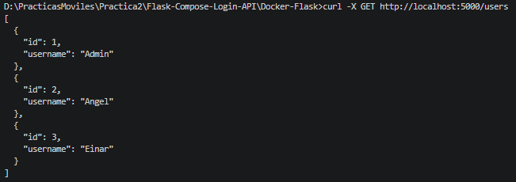
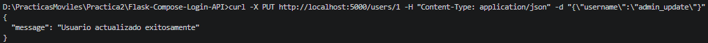
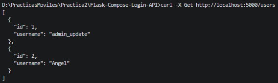

# Práctica 2: Aplicación móvil básica para operaciones CRUD con un servicio REST

## Portada
* **Nombre:** Angel Isai Orozco Aguilar
* **Boleta:** 2024630437
* **Grupo:** 7CV4
* **Asignatura:** Desarrollo de aplicaciones móviles nativas
* **Profesor:** Gabriel Hurtado Avilés
* **Fecha de entrega:** 18 de Septiembre de 2026

---

## Requisitos del Sistema
| Herramienta | Versión    |
| :--- |:-----------|
| Docker Desktop | 29.7.2     |
| Android Studio | 25.0.2     |
| Python (Entorno Docker) | 3.9 - slim |
| Kotlin | 2.0.21     |
| Flask | 3.1.3      |
| SQLite (Visor Opcional) | 3.50.4     |

---

## Introducción
Para realizar esta practica de base se usó el repositorio brindado por el maestro, una vez entendido un poco la forma de estructurar código, cómo se usa la interfaz y cómo se conectan los archivos se empezó el desarrollo de la interfáz.

### Archivos modificados:
* `app/build.gradle.kts`: Se añadieron las dependencias `androidx.navigation:navigation-compose:2.7.7` para habilitar el enrutamiento entre pantallas y `androidx.compose.material:material-icons-extended` para implementar la visibilidad interactiva de la contraseña. Para la comunicación de red, se integraron `com.squareup.retrofit2:retrofit` y `converter-gson` para serialización JSON, junto con las librerías de corrutinas de Kotlin para el manejo asíncrono.
* `MainActivity.kt`: Se eliminó el código estático de prueba para implementar un sistema de enrutamiento dinámico mediante `NavHost`. Se diseñaron las interfaces `LogIn`, `Registro`, `Usuario` y `PanelAdmin` utilizando componentes nativos de Jetpack Compose. Se integró una interfaz `Navegacion` de Retrofit para conectar los eventos de los botones con el servidor Flask.
* `app.py` (Backend): Se integró `Flask-Bcrypt` para el cifrado unidireccional de contraseñas. Se modificó el modelo de base de datos `User` para incluir una columna `role` (administrador/usuario). Se desarrolló el endpoint `POST /login` y un script de arranque que inyecta automáticamente un administrador maestro si la base de datos `site.db` se encuentra vacía.

### Justificación del Stack:
La interfaz se desarrolló utilizando Jetpack Compose de manera declarativa para reaccionar a los cambios de estado (como la visibilidad de la contraseña) sin manipular vistas manualmente, mientras que Retrofit y las corrutinas garantizan una comunicación de red eficiente sin bloquear el hilo de la interfaz de usuario.

---

## Desarrollo

### Conceptos Backend Rest Dockerizado:
* **Docker:** Docker es una plataforma abierta de desarrollo, empaquetado y ejecución de aplicaciones.
  Permite separar las aplicaciones de la infraestructura, así manejando infraestructura cómo si fuesen aplicaciones.
  --*La información pasada es un extracto parafraseado de la página oficial de Docker*--
* **Imagen y Contenedor:** Una imagen es una base con instrucciones para construir un contenedor de Docker.
  Una imagen puede basarse en otra imagen y agregar modificaciones y aún así contar cómo imagen.<br>
  Un contenedor es una instancia ejecutable de una imagen, cada contenedor puede crearse, iniciarse, detenerse, moverse o eliminarse.
  Por defecto, cada contenedor está aislado de los demás, pero se puede controlar el nivel de aislamiento.
  Un contenedor está definido por sus imagenes, asi como las configuraciones con las que se crean o se arrancan.
* **Dockerfile:** Es un documento de texto que contiene todos los comandos que un usuario puede llamar en la línea de comandos para construir una imagen.
* **docker-compose.yml:** Es un archivo de configuración en formato YAML, define, ejecuta y conecta multiples contenedores para wue parezcan una sola aplicación.
* **Backend o Servicio REST:** El Backend es el trasfondo de una aplicación o servicio móvil que procesa la lógica.
  Así, el servicio REST es un tipo de interfaz que permite a ese backend comunicarse con otros programas mediante internet.
* **ORM y Base de Datos:** El ORM es un Mapeador Objeto-Relacional, que es una herramienta de Software que conecta una base de datos relacional con el código de programación orientada a objetos, permite manipular clases y métodos. Permite hacer operaciones CRUD en lenguaje orientado a objetos.

### Operaciones CRUD en el Backend (Flask)
Se amplió el archivo `app.py` para soportar la administración completa de los registros de la tabla `User` en la base de datos SQLite. La persistencia de datos se maneja a través de `flask_sqlalchemy`, y los cambios en el código se reflejan dinámicamente en el contenedor de Docker gracias al mapeo de volúmenes en el archivo `docker-compose.yml`.

| Endpoint | Método HTTP | Descripción | Códigos de Estado |
| :--- | :--- | :--- | :--- |
| `/login` | POST | Valida credenciales contra hashes Bcrypt y devuelve el rol del usuario. | 200, 401 |
| `/register` | POST | Crea un usuario nuevo con rol estándar, encriptando la contraseña ingresada. | 201, 400 |
| `/users` | GET | Devuelve un arreglo JSON con todos los usuarios. Omite el envío de contraseñas por seguridad. | 200 |
| `/users/<id>` | PUT | Actualiza de forma independiente el `username` o `password` (aplicando nuevamente el cifrado de Bcrypt). | 200, 400, 404 |
| `/users/<id>` | DELETE | Elimina permanentemente de la base de datos al usuario correspondiente al ID indicado. | 200, 404 |

### Pruebas de Validación (cURL)
Para comprobar la accesibilidad de las rutas a través del puerto 5000 expuesto por el contenedor, se utilizaron las siguientes peticiones:

1. **Consulta general:** `curl -X GET http://localhost:5000/users`
2. **Modificación parcial:** `curl -X PUT http://localhost:5000/users/1 -H "Content-Type: application/json" -d "{\"username\":\"admin_update\"}"`
3. **Borrado de registro:** `curl -X DELETE http://localhost:5000/users/1`

Imagen de la primera prueba: <br>
<br>
Imagen de la segunda prueba: <br>
<br>
Imagen de la tercera prueba: <br>
<br>
Comprobación de la tercera prueba: <br>
<br>


### Configuración de Red (Emulador)
*Nota: La URL base de la aplicación apunta a la dirección `10.0.2.2:5000` para alcanzar el contenedor local desde el emulador Android, actuando como un puente hacia el localhost de la máquina anfitriona.*

---

## Guía de Despliegue en Entornos Nuevos (Emulador de Android Studio)

Esta sección detalla el proceso paso a paso para ejecutar y evaluar el proyecto desde cero en una computadora distinta, asumiendo el uso del emulador oficial de Android Studio para las pruebas de conectividad.

### 1. Preparación y Arranque del Backend (Docker)
El servidor Flask y la base de datos están completamente contenedorizados, lo que elimina la necesidad de instalar Python o SQLite de forma local en la máquina evaluadora.

* **Requisito previo:** Asegurarse de que el motor de **Docker Desktop** esté abierto y ejecutándose en segundo plano.
* **Ejecución:** Abrir una terminal o línea de comandos, navegar a la subcarpeta del backend (`Docker-Flask/ORM/`) donde se encuentra el archivo `docker-compose.yml`, y ejecutar:
  ```bash
  docker compose up --build
  ```
* **Verificación:** El proceso descargará las dependencias necesarias. Sabrá que el servidor está listo cuando la terminal muestre un mensaje similar a `Running on all addresses (0.0.0.0)` y `Running on http://127.0.0.1:5000`. En este primer arranque, el sistema generará el archivo `site.db` e inyectará automáticamente al usuario `admin_maestro`. Dejar esta terminal abierta.

### 2. Configuración de Enrutamiento (Frontend)
Para que la aplicación móvil logre salir de su entorno virtual y alcance el servidor Docker de la computadora anfitriona, es necesario ajustar la dirección IP en el código fuente del cliente Android.

* En Android Studio, abrir específicamente el proyecto ubicado en la subcarpeta `Android/FlaskLogin/`.
* Utilizar el panel de proyecto para navegar por la ruta `app/src/main/java/ovh/gabrielhuav/flasklogin/` y abrir el archivo `MainActivity.kt`.
* Localizar la declaración del objeto `RetrofitClient` (línea 69).
* Confirmar o modificar la constante `BASE_URL` para que coincida exactamente con la IP de bucle invertido del emulador:
  ```kotlin
  object RetrofitClient {
    private const val BASE_URL = "[http://10.0.2.2:5000/](http://10.0.2.2:5000/)" 
  }
  ```

### 3. Inicialización del Entorno Virtual
* Abrir el **Device Manager** (Administrador de Dispositivos) ubicado en el panel derecho de Android Studio.
* Seleccionar un emulador disponible e iniciarlo (botón ▶). 
* Esperar a que el sistema operativo Android termine de arrancar por completo y la pantalla principal sea visible y responsiva. *(Si el emulador presenta fallos de red previos, se recomienda realizar un "Wipe Data" desde el Device Manager antes de iniciarlo).*

### 4. Compilación y Pruebas de Integración
* Con el emulador activo, presionar el botón general de **Run 'app'** (▶) en la barra de herramientas superior de Android Studio (o usar el atajo `Shift + F10`).
* Android Studio iniciará la sincronización de Gradle y empaquetará el archivo APK.
* Una vez que la aplicación se abra automáticamente en el emulador, realizar la prueba de integración directa introduciendo las credenciales por defecto:
  * **Correo electrónico:** `Admin`
  * **Contraseña:** `admin123`
* Si la configuración es correcta, el sistema mostrará una alerta con el rol "admin" y permitirá el acceso al panel CRUD, confirmando que la aplicación nativa y el contenedor Docker se están comunicando exitosamente.

---

## Conclusiones
Esta práctica fué particularmente dificil porque nunca había manejado estas tecnologías y al iniciar se tuvo que aprender la aplicación de lo que se hacía, la integración y cómo funcionaba me tomó suficiente tiempo cómo para que fuera considerable.<br>
Esta práctica no solo integra tecnologías de desarrollo movil, si no de servidores y encriotación lo cual me sorprendió bastante inicialmente. Por otro lado, el nivel de nivel en la documentación es bastante pesado y exhaustivo, pero seguramente será bastante útil tener este nivel de detalle al buscar empleo. <br>
Por parte de la practica y sus actividades, el hecho de manejar Kotlin nativo y herramientas de desarrollo especificas para Android se notan al momento de usar la aplicación, que si bien no es realmente exigente para los dispositivos se maneja de forma correcta y no presenta mucha mayor cantidad de problemas, por lo que, al menos de forma inicial, doy por concluido y alcanzado el objetivo de la práctica.

---

## Bibliografía
- “Sintaxis básica de redacción y formato - Documentación de GitHub,” GitHub Docs. https://docs.github.com/es/get-started/writing-on-github/getting-started-with-writing-and-formatting-on-github/basic-writing-and-formatting-syntax
- D. Inc, “What is Docker?,” Docker Documentation, Feb. 11, 2026. https://docs.docker.com/get-started/docker-overview/
- D. Inc, “Docker compose,” Docker Documentation, May 28, 2026. https://docs.docker.com/compose/
- A. Fulop, “REST APIs vs. Backend for Frontend,” DEV Community, Aug. 20, 2021. https://dev-to.translate.goog/fulopattila122/rest-apis-vs-backend-for-frontend-4hba?_x_tr_sl=en&_x_tr_tl=es&_x_tr_hl=es&_x_tr_pto=tc